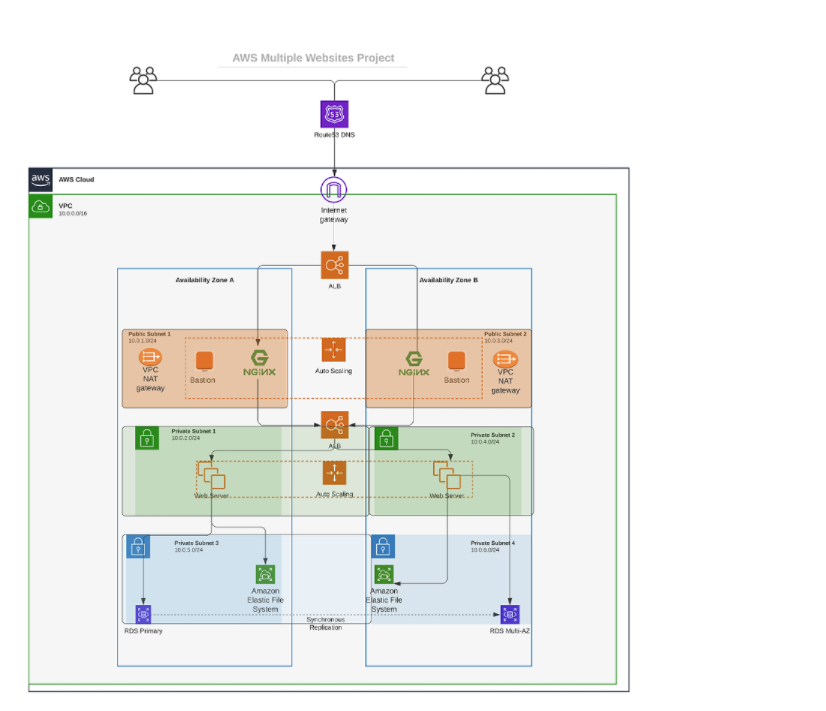

# Automate Infrastructure With IAC Using Terraform Part 2

This is the continuation of the previous project (Project 16) where we automated the deployment of the infrastructure in the image below using Terraform. Check `project.md` for details.

Note that this project can actually be continued from Project 16 as some of the prerequisites have been done there. It is possible to continue this one with the same configuration files.

However, this particular deployment was done from scratch (the complete deployment with all the steps).

